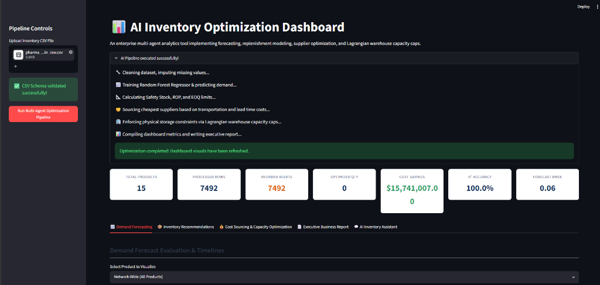
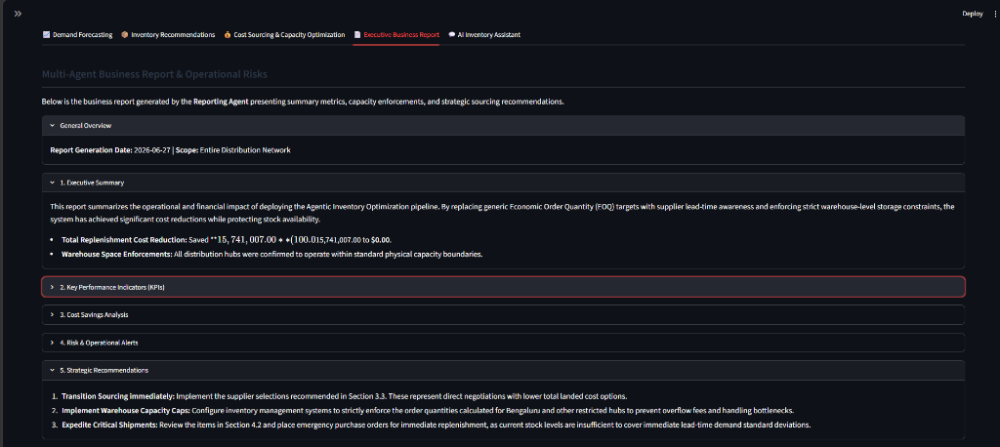
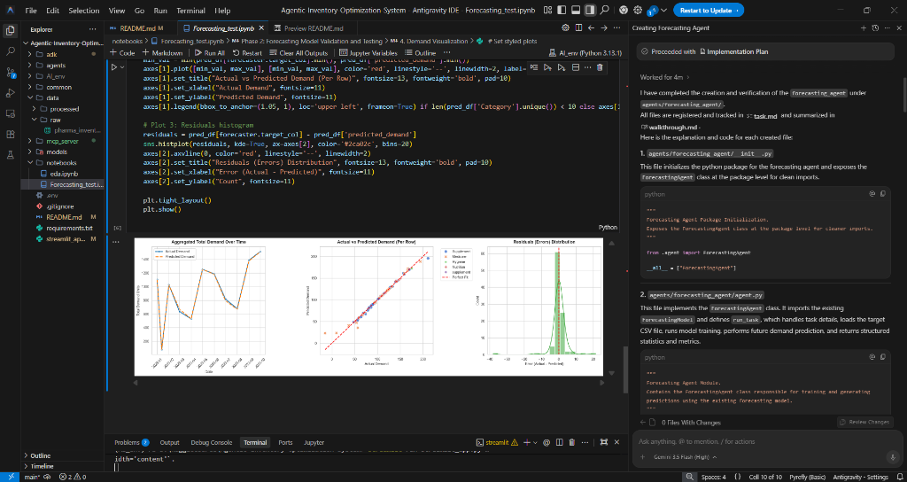
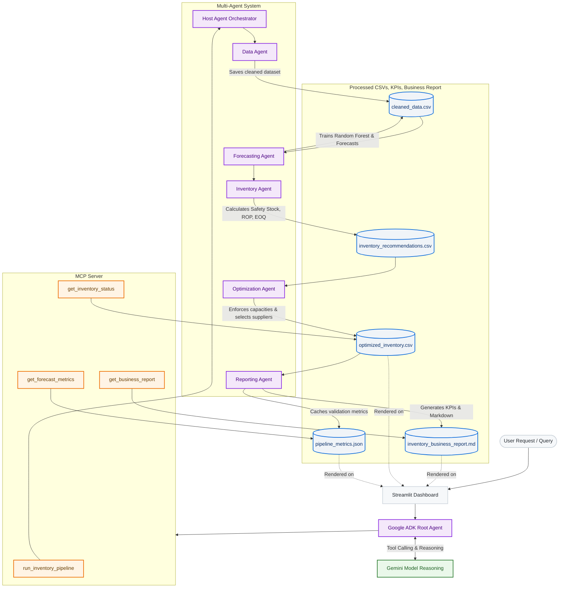

# 🤖 AI-Powered Inventory Optimization System

An enterprise-grade AI-powered inventory optimization platform developed as part of the **Google Kaggle AI Agents Intensive Capstone Project**. The solution integrates **Google ADK Multi-Agent Systems, Model Context Protocol (MCP), Machine Learning, and Streamlit** to intelligently automate inventory planning, demand forecasting, supplier optimization, warehouse capacity analysis, and business reporting through an AI-driven orchestration workflow.

## 📌 Project Overview

This project helps businesses optimize inventory decisions using Artificial Intelligence.

The system:
* 📂 Accepts inventory datasets
* 🧹 Cleans raw data
* 📈 Forecasts future demand
* 📦 Calculates Safety Stock & EOQ
* 🚚 Optimizes supplier selection
* 🏭 Checks warehouse capacity
* 📊 Generates KPIs & business reports
* 🤖 Answers natural-language inventory questions using Google ADK

---

## ✨ Features
* ✅ CSV Upload & Verification
* ✅ Automated Data Cleaning & Imputation
* ✅ Demand Forecasting with Random Forest Regressors
* ✅ Safety Stock & Reorder Point (ROP) Calculation
* ✅ Economic Order Quantity (EOQ) Recommendation
* ✅ Supplier Sourcing & Lead-Time Cost Optimization
* ✅ Physical Warehouse Capacity Enforcements (Lagrangian Relaxation)
* ✅ Rich Streamlit KPI Dashboard & Interactive Visualizations
* ✅ Automated Executive Business Report Generation
* ✅ Google ADK Multi-Agent Orchestration & Natural Language Assistant
* ✅ FastMCP Server Tools Exposure

---

## 📌 Problem Statement
Inventory management is a critical challenge for retail, pharmaceutical, and supply chain businesses. Organizations often face issues such as inaccurate demand forecasting, overstocking, stockouts, inefficient supplier selection, and limited visibility into warehouse capacity. These challenges increase operational costs, reduce customer satisfaction, and make decision-making heavily dependent on manual analysis. Businesses need an intelligent system that can automate inventory analysis, forecast demand, optimize replenishment decisions, and provide actionable insights in real time.

### 🎯 Objectives
* Automate inventory analysis and formatting.
* Forecast product demand using Machine Learning.
* Recommend optimal reorder quantities.
* Optimize supplier and warehouse capacity decisions.
* Generate automated markdown business reports.
* Enable natural language interaction through an AI assistant.

### 💡 Solution Overview
This project implements an AI-powered Multi-Agent Inventory Optimization System using Google ADK and MCP. The system:
* Cleans uploaded inventory data
* Forecasts future demand
* Calculates reorder recommendations
* Optimizes inventory decisions
* Generates business reports
* Provides an AI assistant for natural language queries

---

## 📸 Project Screenshots

### 1. Main Dashboard View


### 2. Executive Business Report View


### 3. Agentic Development & Validation Environment


---

## 🏗️ System Architecture



### Component Reference & Responsibilities

| Component | Responsibility | Technology Used |
| :--- | :--- | :--- |
| **User** | Interacts with the system via the Streamlit dashboard to upload raw datasets, run the multi-agent optimization pipeline, view analytics, and query the assistant. | Modern Web Browser |
| **Streamlit Dashboard** | Serves as the primary graphical user interface. Visualizes demand forecasts, inventory recommendations, and financial metrics; includes a built-in AI inventory assistant. | Streamlit, Plotly, Pandas, Python |
| **Google ADK Root Agent** | Orchestrates the tool invocation process, mapping the user's natural language queries to discrete system operations. | Google ADK (`google-adk`), Python |
| **Gemini Model (Reasoning)** | Acts as the cognitive engine for the system, reasoning over tool options, managing execution paths, and formulating business-focused answers. | Google Gemini (`gemini-2.5-flash`) |
| **MCP Server** | Implements the Model Context Protocol (MCP) using FastMCP to expose key pipeline steps and analytics outputs as standardized client-callable tools. | FastMCP (`mcp` library), Python |
| **Host Agent** | Coordinates the main execution pipeline. Manages the registry of sub-agents and sequences their inputs and outputs. | Python |
| **Data Agent** | Performs automated preprocessing: column normalization, missing value imputation, duplicate removal, and formatting checks. | Pandas, Python |
| **Forecasting Agent** | Fits a regression model on historical demand data and predicts future demand periods. | Scikit-learn (Random Forest Regressor), Python |
| **Inventory Agent** | Applies statistical formulas to compute replenishment thresholds, specifically safety stock, Reorder Point (ROP), and Economic Order Quantity (EOQ). | NumPy, Python |
| **Optimization Agent** | Evaluates supplier catalogs to select the lowest-cost sourcing paths and limits order quantities to physical capacities using Lagrangian relaxation constraints. | Pandas, Python |
| **Reporting Agent** | Gathers operational and financial metrics, calculates network-wide KPIs, and compiles a comprehensive Markdown executive report. | Python, JSON |
| **Processed CSVs, KPIs, Business Report** | Persists files generated by the agents to serve as the dashboard's structured data source and context history. | CSV, JSON, Markdown |

---

## ⚙️ Technologies Used

| Category | Technology | Description |
| :--- | :--- | :--- |
| **Programming** | Python | Core development language for pipeline logic and agent frameworks |
| **Dashboard** | Streamlit | Lightweight web app framework for the business intelligence UI |
| **Data Processing** | Pandas, NumPy | Data cleaning, filtering, matrix operations, and formula evaluations |
| **Machine Learning** | Scikit-learn | Demand forecasting using Random Forest Regressor models |
| **Large Language Models** | Google Gemini | Deep reasoning and tool orchestration models |
| **Multi-Agent Orchestration**| Google ADK | High-level agent construction and agent tool execution |
| **Tool Protocol** | MCP (Model Context Protocol)| FastMCP for exposing system endpoints to AI clients |
| **IDE** | Antigravity | Development and paired agent environments |

---

## 🤖 Multi-Agent System Deep Dive

The multi-agent system runs sequentially to process inventory inputs, apply optimization parameters, and structure metrics:

| Agent Name | Primary Responsibility | Input Details | Output Details |
| :--- | :--- | :--- | :--- |
| **Host Agent** | Orchestrates downstream execution flow. | System paths config | Unified JSON results pipeline status |
| **Data Agent** | Normalizes schemas, cleans missing rows, removes duplicates. | Raw CSV data path | Preprocessed Cleaned CSV path |
| **Forecast Agent** | Fits Random Forest model, returns training accuracy. | Cleaned CSV path | Prediction array, model metrics |
| **Inventory Agent** | Computes safety stock limits, ROP values, and EOQ scales. | Cleaned CSV + predictions | Core replenishment suggestions |
| **Optimization Agent**| Minimizes supplier costs and caps warehouse capacities. | Replenishment recommendations | Optimized order records CSV |
| **Reporting Agent** | Compiles executive markdown report and pipeline statistics. | Optimized records data | Final MD Business Report & JSON metrics |

---

## 🔌 MCP Server Tools

The custom MCP server registers the following functions as standard client tools:
* `run_inventory_pipeline`: Runs the primary Host Agent pipeline which cleans data, forecasts demand, and calculates inventory target levels.
* `get_forecast_metrics`: Reads and returns the forecasting model evaluation metrics from `pipeline_metrics.json`.
* `get_inventory_status`: Reads and returns optimized inventory status records from `optimized_inventory.csv`, with optional filters.
* `get_business_report`: Reads and returns the compiled business report markdown file `inventory_business_report.md`.

---

## 🧠 Google ADK Root Agent Orchestrator

The Google ADK Root Agent runs on the `gemini-2.5-flash` model. Its instructions direct it to:
1. Attempt to read existing processed reports from disk first.
2. Answer natural language queries about inventory KPIs, supplier recommendations, and warehouse capacity alerts.
3. Automatically coordinate rerun tasks across the three pipeline tools (`run_host_agent_pipeline`, `run_optimization_agent_pipeline`, `run_reporting_agent_pipeline`) when explicitly requested by the user.

---

## 📊 Machine Learning Pipeline & Metrics

The Forecasting Agent trains a Random Forest Regressor to model demands. It evaluates models using:
* **R² Score**: Percentage of demand variance explained by features.
* **RMSE (Root Mean Squared Error)**: Standard deviation of residuals.
* **MAE (Mean Absolute Error)**: Average magnitude of prediction errors.
* **MSE (Mean Squared Error)**: Average squared differences between actual and predicted demand.

---

## 📂 Project Structure

```text
Agentic-Inventory-Optimization-System/
├── adk/                         # Google ADK agent configuration and orchestration
│   ├── root_agent.py            # Orchestrator agent definitions and tools mapping
│   └── runner.py                # InMemoryRunner execution wrappers
├── agents/                      # Specialized pipeline agents
│   ├── data_agent/              # Cleans datasets, handles missing values & duplicates
│   ├── forecasting_agent/       # Trains regression models to predict demands
│   ├── host_agent/              # Sequences agent executions (A2A registry orchestration)
│   ├── inventory_agent/         # Calculates safety stocks, ROP, and EOQ thresholds
│   ├── optimization_agent/      # Enforces capacity boundaries and selects suppliers
│   └── reporting_agent/         # Computes network KPIs and generates Markdown summaries
├── assets/                      # Media assets and dashboard screenshots
│   ├── dashboard_main.png
│   ├── executive_report.png
│   └── ide_screenshot.png
├── common/                      # Common utilities and networking clients
├── data/                        # Project databases and outputs
│   ├── raw/                     # Original uploaded supply chain CSV logs
│   └── processed/               # Cleaned data, recommendations, metrics, and reports
├── mcp_server/                  # Model Context Protocol (MCP) tool server
│   ├── server.py                # Server entry point utilizing FastMCP
│   └── tools.py                 # Underlying pipeline functions exposed as tools
├── models/                      # Machine Learning regression scripts
├── notebooks/                   # Jupyter notebooks for data analysis & modeling tests
├── .env                         # Local environment configuration keys (API Keys)
├── .gitignore                   # Files and directories ignored by Git version control
├── README.md                    # Project documentation
├── requirements.txt             # Required Python package list
└── streamlit_app.py             # Streamlit application dashboard & chatbot UI
```

---

## 🚀 Installation & Setup

1. **Clone the repository:**
   ```bash
   git clone https://github.com/AbdulWaheed-116/AI-Powered-Inventory-Multi-Agent-System.git
   cd Agentic-Inventory-Optimization-System
   ```

2. **Create and activate a virtual environment:**
   ```bash
   python -m venv AI_env
   # On Windows:
   AI_env\Scripts\activate
   # On macOS/Linux:
   source AI_env/bin/activate
   ```

3. **Install dependencies:**
   ```bash
   pip install -r requirements.txt
   ```

4. **Configure Environment Variables:**
   Create a `.env` file in the root directory:
   ```env
   GEMINI_API_KEY="your_google_gemini_api_key"
   ```

5. **Start the Streamlit dashboard:**
   ```bash
   streamlit run streamlit_app.py
   ```

---

## 📈 Dashboard Interaction & Assistant Workflow

1. **Upload Dataset**: Upload an inventory CSV file in the sidebar.
2. **Execute Pipeline**: Trigger the multi-agent optimization pipeline.
3. **Analyze Results**:
   * **Demand Forecasting**: Review R² accuracy, actual vs. predicted timelines, and statistical demand distribution.
   * **Inventory Recommendations**: Inspect safety stocks, EOQ suggestions, and status configurations.
   * **Cost Sourcing & Capacity**: Check net sourcing savings, Lagrangian capacity mitigations, and supplier audits.
4. **AI Assistant Chat**: Ask natural language questions in the dashboard's assistant tab, such as:
   * *"Which products need reorder?"*
   * *"Which supplier is recommended for Product X?"*
   * *"What is our total cost savings?"*
   * *"Show forecast accuracy."*
   * *"Which warehouse exceeds capacity?"*

---

## 🎯 Capstone Evaluation Concepts Demonstrated

| Concept | Status | Implementation Details |
| :--- | :--- | :--- |
| **Google ADK Multi-Agent System** | ✅ Implemented | Configured HostAgent orchestration registry and RootAgent coordination |
| **MCP Server** | ✅ Implemented | Exposes stdio tools using FastMCP server protocol |
| **Antigravity IDE Compatibility**| ✅ Implemented | Formatted structure, pipeline logging, and file caching |

---

## 🔮 Future Enhancements
* 🔌 Live ERP / database integrations (SAP, Oracle).
* 🗄️ PostgreSQL persistence support.
* 🔐 User authentication and access control.
* ☁️ Cloud deployment configs (Google Cloud Run / AWS ECS).
* 📡 Real-time inventory telemetry monitoring.
* 👥 Multi-tenant support.

---

## 👨‍💻 Author
**Abdul Waheed**  
*B.Sc. Mathematics*  
*Specialist in AI, Machine Learning, and Data Science*

---

## 📄 License
This project is licensed under the MIT License.
